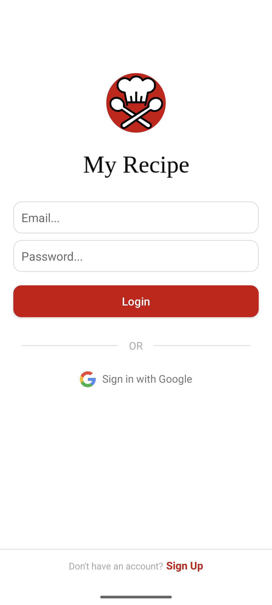
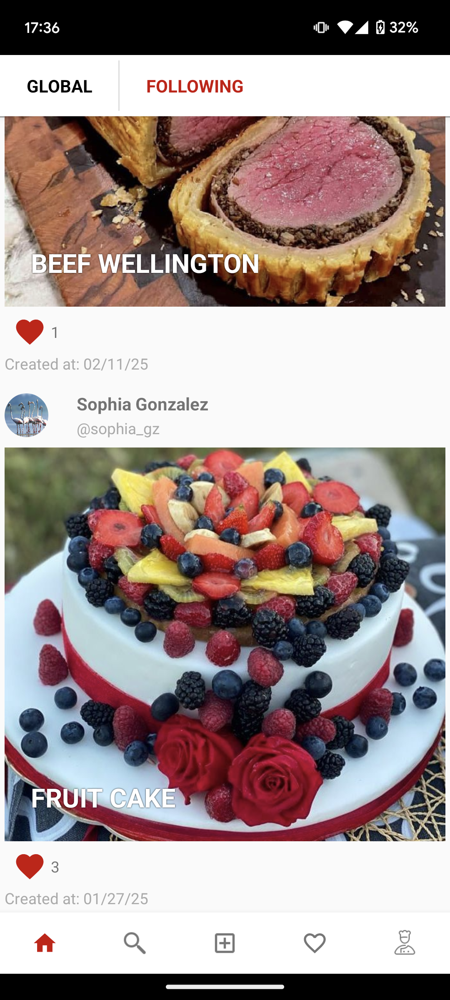
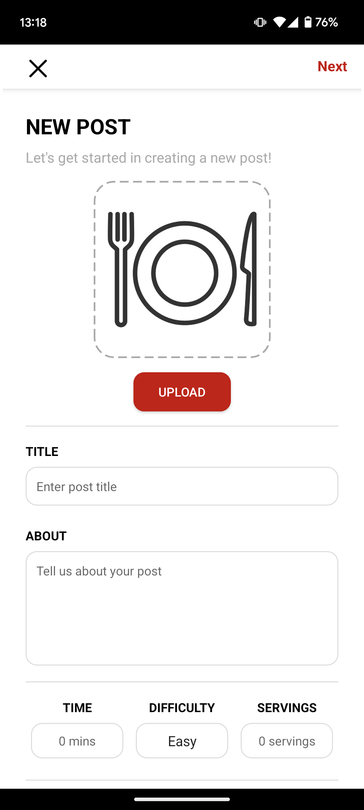
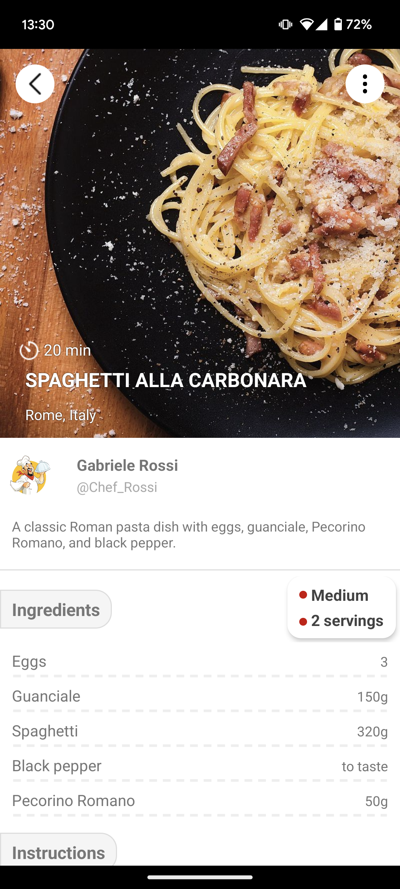
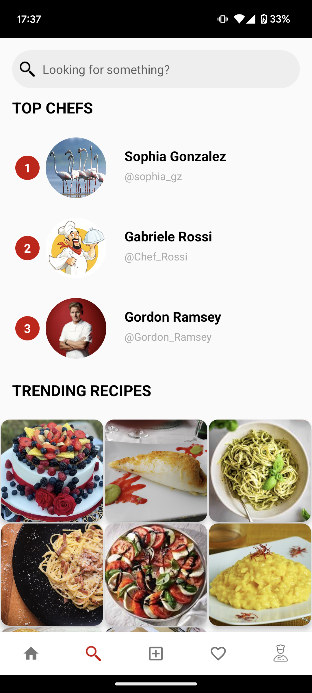
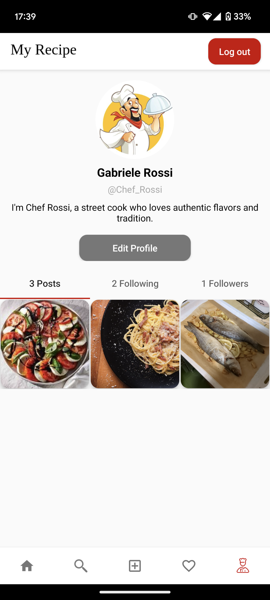

### Mobile Applications & Cloud Computing - MyRecipe

In this project, a **recipe-sharing social app** was developed using **Kotlin** in **Android Studio**. The app allows users to **upload their homemade recipes**, complete with images and step-by-step instructions.
It includes all the usual windows of a social platform (posts, profile, search...) while maintaining an intuitive and simple user experience. These are visible below.

    
    
    
    
    
    

### Key Features and Implementation  

**Graphical Elements & UI Enhancements**  
- The app includes **dynamic lists** that display user-uploaded recipes in an interactive feed.  
- As animation have been implemented a **double-click post heart animation** and a **progress bar** for image loading and refreshing the feed when scrolling down.  

**Multi-User System & Authentication**  
- Users can **sign in via Firebase Authentication** using **Google login** or **email/password authentication**.  
- Each user has a **profile section** displaying their uploaded recipes, followers, and following. Different users can use the app at the same time.  

**Cloud Services & Database Structure**  
- **CRUD MySQL Database on PythonAnywhere**: Stores **recipes** and their details (title, image, ingredients, steps, etc.). 
- **Flask Web API**: Acts as the **server**, handling communication between the app and the MySQL database for retrieving and storing recipe data.  
- **Firebase Realtime Database**: Manages **user-related information**, such as name, username, profile image, followers, following, and likes.  

**Media & Sensor Integrations**  
- Users can **upload recipe images** from their **gallery** or **capture photos using the camera**.  
- The app also integrates **GPS functionality** for potential location-based features.

**External API**
- Use of external **Google Maps API** to load the map and get the location information.

**Concurrency & Performance Optimization**  
- **Kotlin Coroutines** are used in the **Home Fragment** to efficiently fetch recipes from the MySQL database and retrieve user information from Firebase.  
- These processes run in the background, ensuring a smooth and responsive UI.  

### Group members
- Niccolò Piraino
- Pasquale Aliperta
